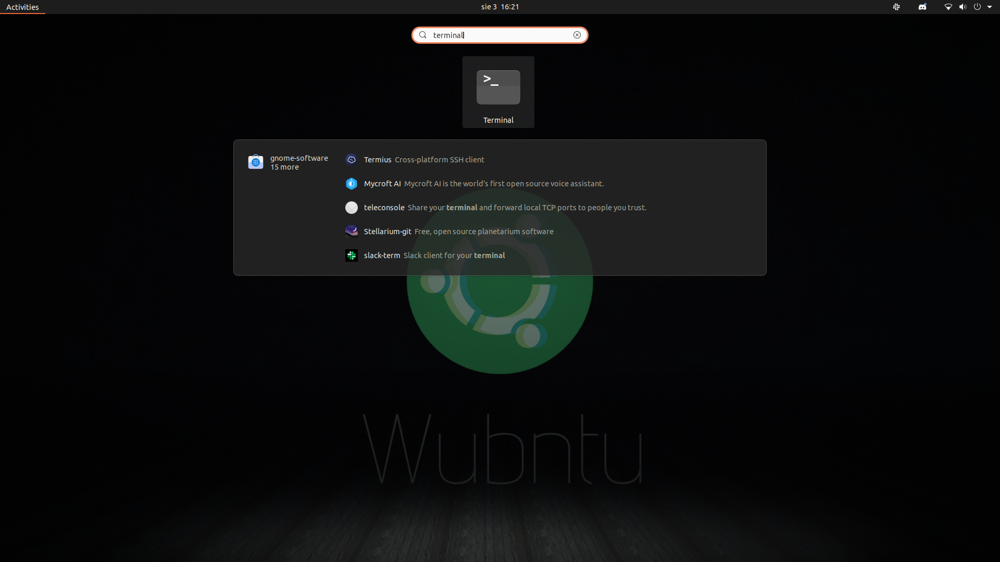
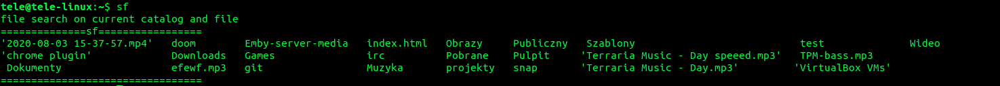

# how to add sf command on ubuntu

open a terminal

go to directory where sf file is located with cd command

make sure the program can be run in the sf file settings

enter the command "sudo cp sf /usr/bin"

enter root user pass

type the sf command in the directory where some files are located and a list of files in the directory will be printed

end.
